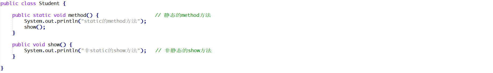

## 1 概念题

##### 1.1 继承概述 

```java
答：
```

##### 1.2 继承的好处  

```java
答：
```

##### 1.3 Java中继承的特点 

```java
答：
```

##### 1.4 Java中继承的注意事项?以及我们什么时候使用继承? 

```java
答：
```

##### 1.5 继承中的成员访问特点 

```java
答：
```

##### 1.6 继承中构造方法的执行流程? 

```java
答：
```

##### 1.7 方法重写和方法重载的区别?方法重载能改变返回值类型吗? 

```java
答：
```

##### 1.8 this关键字和super关键字分别代表什么?以及他们各自的使用场景和作用。  

```java
答：
```

##### 1.9 final关键字可以干什么?有什么特点? 

```java
答：
```

##### 1.10 static关键字可以修饰什么？有什么特点？

```java
答：
```

------


## 2 简答题

##### 2.1 简答题一

通过idea在创建某一个类的时候可能会出现如下错误，请说明产生该错误的原因是什么？

|  

```java
答：
```

------

##### 2.2 简答题二

请分析如下程序编译是否会报错并说明原因？并给出正确的代码！

|  |
| ---------------------------------------- |
|  |

```java
答：
```

------

##### 2.3 简答题三

请分析如下程序在控制台的执行结果并说明原因？

|  

```java
答：
```

------

##### 2.4 简答题四

请分析如下程序编译是否会报错并说明原因？

|  

```java
答：
```

------

##### 2.5 简答题五

请分析如下程序编译是否会报错并说明原因？

|  

```java
答：
```

------

###  3 代码题

#### 3.1 第一题: 分析以下需求，并用代码实现

	1.定义动物类(TEST4.Animal)
	   a) 成员变量:int 年龄(age), int 腿的个数(numOfLegs)
	   b) 定义eat()方法，方法内容不写。
	   c) 提供空参和满参构造方法和set/get方法
	2.定义老虎类(Tiger)继承动物
	   a) 重写eat()方法
			  输出格式: 年龄为 XX的YY条腿的老虎在吃羊
	   (PS:XX为年龄age属性,YY为腿的个数numOfLegs属性,下面重复出现同理)
	   b) 提供空参和满参构造方法
	3.定义兔子类(Rabbit)继承动物
	   a) 重写eat()方法
			  输出格式: 年龄为 XX岁的YY条腿的兔子在吃狗尾草
	   b) 提供空参和满参构造方法
	4.定义测试类Test
	   a) 提供main方法
	   b) 在main方法中
	   i.创建老虎对象 t,年龄赋值为2,腿的个数赋值为4;调用老虎对象t的eat()方法
	   ii.创建兔子对象 r,年龄赋值为1,,腿的个数赋值为4;调用兔子对象r的eat()方法

------

#### 3.2 第二题：分析以下需求，并用代码实现

	1.定义项目经理类 
		属性： 姓名 工号 工资 奖金
		行为： 工作work
	2.定义程序员类
		属性：	姓名 工号 工资
		行为：	工作work
	3.要求:向上抽取一个父类,让这两个类都继承这个父类,共有的属性写在父类中，子类重写父类中的方法
		编写测试类:完成这两个类的测试

------

#### 3.3 第三题:  分析以下需求，并用代码实现

	1、定义动物类
		属性：姓名、年龄
		方法：吃饭方法，内容为："吃饭..."
	2、定义猫类，继承动物类
		重写父类中的吃饭方法，内容为：“年龄为xx的xx猫在吃鱼...”
	3、定义狗类，继承动物类
		重写父类中的吃饭方法，内容为：“年龄为xx的xx狗在吃骨头...”
	4、定义测试类
		分别创建猫对象和狗对象，并分别给父类对象中的名称和年龄属性赋值；
	5、分别使用猫对象和狗对象获取名称和年龄的属性值并打印在控制台上；
	6、分别使用猫对象和狗对象调用吃饭方法；

​		


