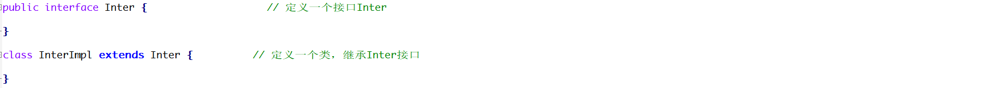
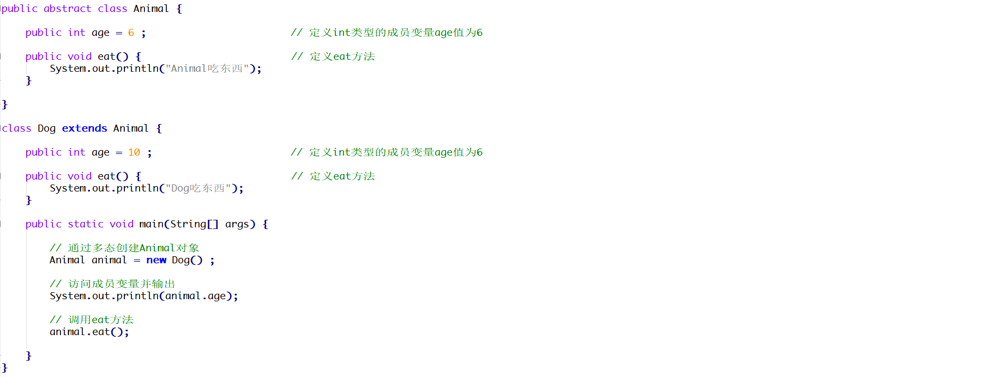

# 1 简答题

## 1.1 简答题一

请分析如下程序是否会报错(编译版本JDK1.8)并说明原因？并给出正确的代码！

|  |
| ------------------------------------------------------------ |

```java
答：
```

## 1.2 简答题二

请分析如下程序是否会报错并说明原因？并给出正确的代码！

|  |
| ------------------------------------------------------------ |

```java
答：
```

## 1.3 简答题三

请分析如下程序是否会报错并说明原因？并给出正确的代码！

|  |
| ------------------------------------------------------------ |

```java
答：
```

## 1.4 简答题四

请分析如下程序那几行代码会报错并说明原因？

|  |
| ------------------------------------------------------------ |

```java
答：
```

## 1.5 简答题五

请分析如下程序是否会报错并说明原因？并给出正确的代码！

|  |
| ------------------------------------------------------------ |

```java
答：
```

## 1.6 简答题六

请分析如下程序是否会报错并说明原因？

|  |
| ------------------------------------------------------------ |

```java
答：
```

## 1.7 简答题七

请分析如下程序在控制台的输出结果是什么并说明原因？

|  |
| ------------------------------------------------------------ |

```java
答：
```

## 1.8 简答题八

请分析如下程序在控制台的输出结果是什么并说明原因？以及如何避免该问题？

|  |
| ------------------------------------------------------------ |

```java
答：
```

# 2 编程题

## 2.1 编程题目一

**训练目标**：掌握Java中多态的使用，以及理解其在实际开发中的应用

**需求描述**：对第二天所完成的msg项目的代码进行优化，解除Entry类和AliyunSendMsg或者TencentSendMsg对象的耦合度。案例运行效果和第二天代码一致，如下所示：

1、当在Entry类中获取的是AliyunSendMsg对象时，在控制台输出

|  |
| ------------------------------------------------------------ |

2、当在Entry类中获取的是TencentSendMsg对象时，在控制台输出 

|  |
| ------------------------------------------------------------ |

**实现提示**：

1、创建一个工厂类，在该工厂类中定义一个静态方法，该方法返回值类型是AliyunSendMsg或者TencentSendMsg类的父类类型

2、对Entry类中创建AliyunSendMsg或者TencentSendMsg对象的代码进行改造，调用工厂类的静态方法获取指定对象进行使用


## 2.2 编程题目二

**训练目标**：掌握Java中接口以及多态的使用，以及理解其在实际开发中的应用

**需求背景**：现在互联网中存在很多的云存储平台(七牛云、阿里云oss)，这些存储平台是类似于百度网盘，可以存储文件。如下所示：

|  |
| ------------------------------------------------------------ |

**需求描述**：请在素材的store项目中设计一个存储接口，并且在Entry类的指定位置补全代码使程序可以正常运行。案例的实现效果如下所示：

1、当用户输入1时，控制台输出如下结果

|  |
| ------------------------------------------------------------ |

2、当用户输入2时，控制台输出如下结果

|  |
| ------------------------------------------------------------ |

**实现提示**：

1、在inter包中定义存储接口(接口中可以定义一个抽象方法，方法参数字符串类型，表示要上传的本地磁盘文件的路径)和该接口的实现类

2、在Entry类中定义一个接收接口类型参数的方法，方法中代码逻辑如下所示：

* 在该方法中键盘录入要上传的本地文件的磁盘路径(比如：D:\a.jpg)
* 调用接口方法将本地文件上传到指定的存储平台上

3、在Entry类中根据用户的输入情况创建第一步定义的接口的子类对象，调用第二步的方法

4、存储功能(由于知识储备不足，此处可以通过输出语句进行模拟)


## 2.3 编程题目三

**训练目标**：掌握Java中接口以及多态的使用，以及理解其在实际开发中的应用

**需求背景**：某网站需要开发一个支付功能，需要支持多种支付方式(支付平台支付、银行卡网银支付、信用卡快捷支付)，如下所示：

|  |
| ------------------------------------------------------------ |

**需求描述**：请在素材的payment项目中设计一个支付接口，并且在Entry类的指定位置补全代码使程序可以正常运行。案例的实现效果如下所示：

1、当用户输入1时，控制台输出如下结果

|  |
| ------------------------------------------------------------ |

2、当用户输入2时，控制台输出如下结果

|  |
| ------------------------------------------------------------ |

3、当用户输入3时，控制台输出如下结果

|  |
| ------------------------------------------------------------ |

**实现提示**：

1、在inter包中定义支付接口(接口中可以定义一个抽象方法，方法参数double类型，表示要支付的总金额)和该接口的实现类

2、在factory包中定义工厂类，该工厂类主要是获取对应的支付接口的子类对象

3、在Entry类中可以调用工厂类的方法根据用户输入的数值获取指定的支付接口子类对象

4、支付功能(由于知识储备不足，此处可以通过输出语句进行模拟)


