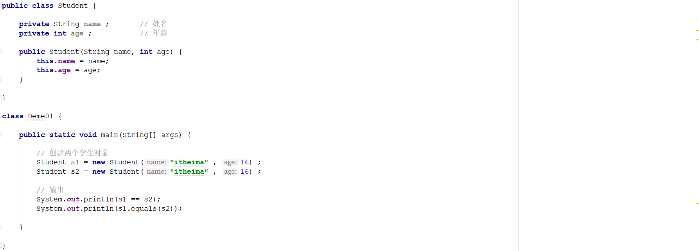
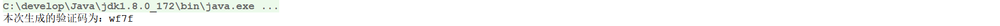

# 1 选择题

## 1.1 选择题一

如下程序想在控制台输出30,20,10那么在9,10,11行代码的输出语句中，请选择正确的选项（）

- A. 第9行：this.num   第10行：this.this.num  第11行： super.num
- B. 第9行：num   第10行：this.this.num  第11行： super.num
- C. 第9行：num   第10行：this.num  第11行： super.num
- D. 第9行：num   第10行：this.num  第11行： Outer.this.num

## 1.2 选择题二

下面lambda表达式的书写是否正确并说明原因？请选择正确的代码（）

 

- A. show(int a,int b -> a + b);
- B. show(a,b -> return a+b);
- C. show((a,b)->return a + b);
- D. show((a,b)-> a+b);

## 1.3 选择题二

请分析如下程序执行完毕以后在控制台的输出结果，请选择正确选项（）

 

- A. 编译报错，Student类中没有equals()方法。
- B. true,false
- C. true,true
- D. false,false

## 1.4 选择题四

请分析如下程序执行完毕以后在控制台的输出结果，请选择正确选项（）

 

- A.编译报错，Teacher类中没有父类，不能重写方法。
- B.第一个输出Student对象的地址值，第二个输出Teacher对象的地址值。
- C.第一个输出Student对象的地址值，第二个输出“我是一名老师！”。
- D.以上都不对。

# 2 编程题

## 2.1 编程题目一

**训练目标**：掌握Java中BigDecimal的使用

**需求描述**：日常开发中，浮点数参数运算场景不少，但是java中浮点数在运算时往往不够精确，所以需要别的方式来解决，请并且给出精确输出(得到结果为0.2)的代码！

 |
| ------------------------------------------------------------ |

执行完毕以后在控制台的数据结果为：

|  
| ------------------------------------------------------------ |

## 2.2 编程题目二

**训练目标**：掌握Java中匿名内部类的使用

**需求描述**：笔试题(补全代码)：在素材的Inter.java文件中的Outer类的指定位置补全代码，使OuterDemo中的main方法可以进行正常运行！案例的执行效果如下所示：

|  |
| ------------------------------------------------------------ |

**实现提示**：

1、定义一个静态的method方法

2、该方法返回一个匿名内部类

## 2.3 编程题目三

**训练目标**：掌握Java中lambda表达式的使用

**需求背景**：在注册网站用户的时候，大部分的网站都会先生成一个随机的验证码展示给用户，用于区分正常人和机器的操作。如下图所示：

|  |
| ------------------------------------------------------------ |

**需求描述**：在素材的supplier项目的Entry类的指定位置补全代码(调用verificationCode方法)，实现一个生成四位随机验证码! 案例的执行效果如下所示：

|  |
| ------------------------------------------------------------ |

**实现提示**：

1、verificationCode方法参数Supplier<String>说明如下所示：

|  |
| ------------------------------------------------------------ |

2、生成验证码的字符可以从OPTIONS_CAHS中获取

3、调用verificationCode方法获取一个4位的随机验证码

## 2.4 编程题目四

**训练目标**：掌握Java中lambda表达式的使用

**需求描述**：在素材的function项目中指定的位置补全代码，实现从userNames数组中随机获取一个元素返回(点名器)! 案例的执行效果如下所示：

**实现提示**：

1、getUserName方法参数Function<String[] , String>说明如下所示：

2、使用lambda表达式完成getUserName方法调用

