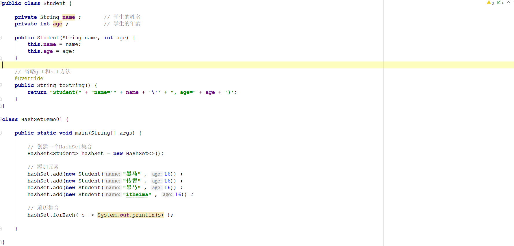
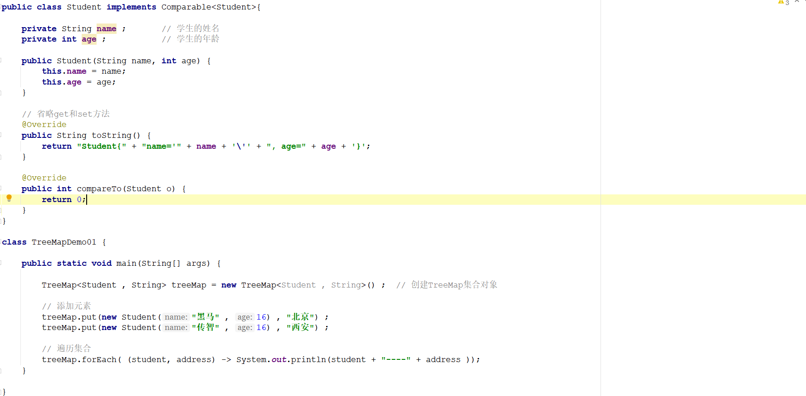
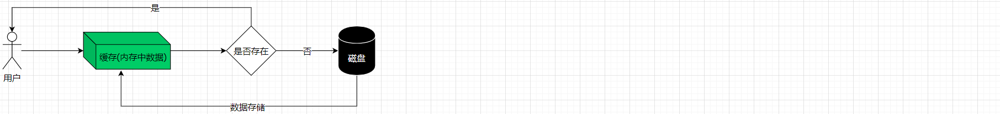
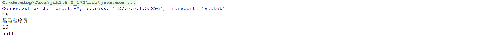
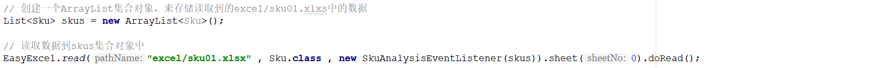
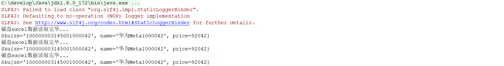
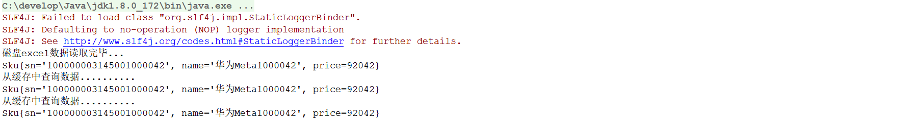

# 1 简答题

## 1.1 简答题一

请说明下述程序执行完成以后会输出几个学生的姓名和年龄并说明原因？如果只想保留一个姓名为"黑马"年龄为16的学生应该怎么处理？【业务要求：如果两个学生对象的姓名和年龄都相同则认为

是同一个对象】

|  |
| ------------------------------------------------------------ |

```java
答：
```

## 1.2 简答题二

简述HashSet集合底层的数据结构、扩容原理以及JDK1.8引入红黑树的意义？

```java
答：
```

## 1.3 简答题三

请说明下面程序执行完毕以后在控制台的输出结果是什么？并说明原因？

|  |
| ------------------------------------------------------------ |

```java
答：
```

## 1.4 简答题四

请说明下述程序执行完毕以后在控制台会输出几个元素并且元素的内容是什么？并说明原因？如果想对学生进行先按照年龄从小到大排序，如果年龄相同则按照姓名从小到大进行排序应该怎么实

现？

|  |
| ------------------------------------------------------------ |

```java
答：
```

## 1.5 简答题五

请分析下述程序存在的问题并说明原因？

|  |
| ------------------------------------------------------------ |

```java
答：
```

## 1.6 简答题六

下述程序执行完毕以后在控制台输出的结果是什么？请从源码的角度分析产生该问题的原因！

```java
// 创建一个ArrayList集合对象，并向其中添加元素
List<String> list = new ArrayList<>();
list.add("传智播客") ;
list.add("黑马程序员") ;
list.add("传智教育") ;

// 把上述ArrayList集合转换成不可变的list集合
List<String> unmodifiableList = Collections.unmodifiableList(list);

// 向unmodifiableList集合中再次添加元素
unmodifiableList.add("itheima") ;

// 遍历集合
for(String s : unmodifiableList) {
    System.out.println(s);
}
```

```
答：
```


# 2 编程题

## 2.1 编程题目一

**训练目标**：掌握Java中Map集合的使用，以及理解其在实际开发中的应用

**需求背景**：在京东商城上进行商品搜索的时候，往往会有一个搜索的面板用来展示搜索条件供用户实现按照条件搜索的功能，如下所示：

|  |
| ------------------------------------------------------------ |

**需求描述**: 请选择Java中合适的集合对象来存储上述搜索面板中的数据，并进行遍历。效果如下所示：

|  |
| ------------------------------------------------------------ |

**实现提示**：

1、搜索类别和搜索条件之间存在对应关系，可以考虑使用Map集合进行存储

2、一个搜索类别对应多个搜索条件并且不能重复，因此搜索条件可以考虑使用Set集合进行存储


## 2.2 编程题目二

**训练目标**：掌握Java中Map集合的使用，以及理解其在实际开发中的应用

**需求背景**：在真实的开发中为了保证数据的安全性，往往需要将数据存储到磁盘上(内存保存中的数据，当程序重启以后数据就丢失了)。每一次在使用的时候都是通过某种技术从磁盘上读取数据到

内存中，然后进行使用。磁盘数据的读取速度是远远的小于内存的，因此为了提高数据的读取效率，可以将读取到的数据存储到内存中，然后先从内存中读取数据，如果内存中有数据直接进行返

回；如果内存中没有数据再次从磁盘上读取数据，并且将磁盘上读取到的数据再次存储到内存中，供下次进行数据的读取。这样就大大的提高了程序的读取数据效率(从磁盘上读取数据的次数大大

降低了)，这种思想就是<font color='red'>缓存思想</font>。整体的数据读取流程如下图所示：

|  |
| ------------------------------------------------------------ |

在设计缓存的时候往往会使用到Map集合进行数据的存储，因为存储在内存中的数据需要设置一个名字，后期就可以根据这个名字获取到对应的数据。这个Map的键的类型是字符串，值的类型可

以有多种：String、List 、Set、HashMap ...

**需求描述**: 在素材的cache项目中设计了一个缓存工具类RedisTemplate，请在指定的位置补全代码，使Entry程序可以进行正常运行。案例效果如下所示：

|  |
| ------------------------------------------------------------ |

**实现提示**：

1、在DefaultValueOperations类中补全代码(成员变量位置创建一个HashMap集合对象：键为String类型，值为String类型)

2、在DefaultHashOperations类中补全代码(成员变量位置创建一个HashMap集合对象：键为String类型，值为HashMap<String , String>类型)


## 2.3 编程题目三

**训练目标**：掌握给程序添加缓存的思想，以及理解其在实际开发中的应用

**需求背景**: 在素材的use-cache项目中Entry这个类中提供了一个根据商品的条码查询商品数据的方法(getSkuBySn),商品的数据来源于sku01.xlsx表格，读取表格中数据到一个List集合中的代码

已经实现，如下所示：

|  |
| ------------------------------------------------------------ |

但是目前这种方式每一次读取数据的时候都是从磁盘中进行读取，效率较低。程序的执行效果如下所示：

|  |
| ------------------------------------------------------------ |

**需求描述**：现需要对Entry类中的getSkuBySn方法添加查询缓存的逻辑代码以提高数据的查询效率。程序执行完毕以后效果如下所示：

|  |
| ------------------------------------------------------------ |

**实现提示**：

1、将编程题目二中的cache项目打包成一个jar加入到use-cache项目中的lib目录下

2、在进行查询的时候先从缓存中进行查询，缓存中如果有数据直接返回

3、缓存中没有数据读取磁盘excel文件数据，然后在将获取到的数据存储到缓存中


