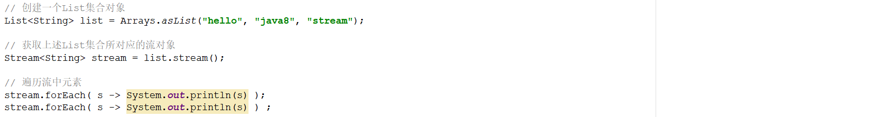
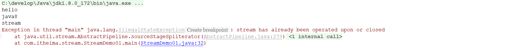
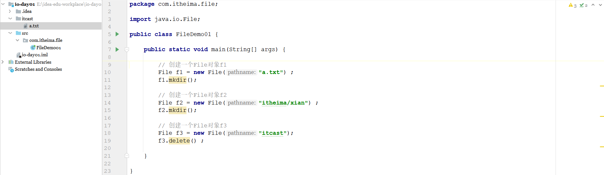
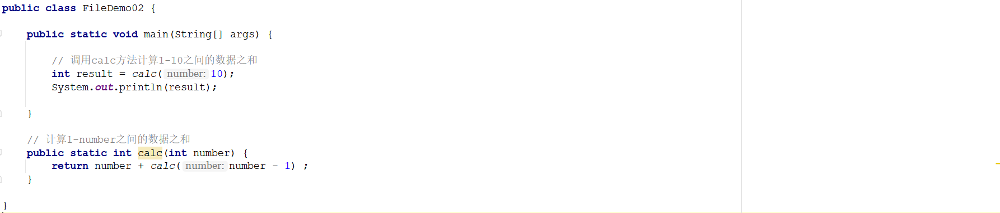
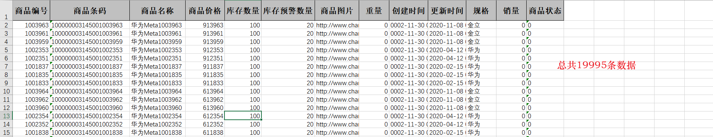
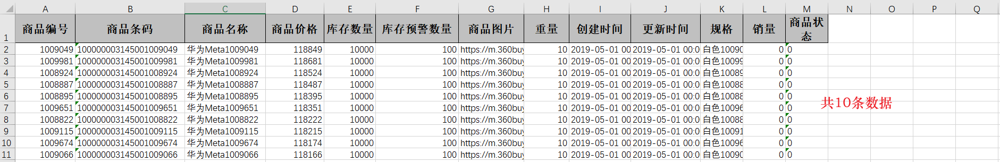
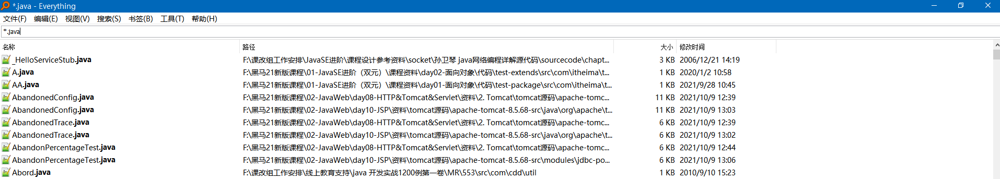
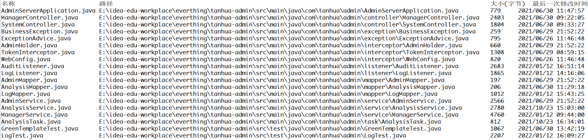

# 1 简答题

## 1.1 简答题一

简述Stream流的使用思想以及获取Stream流的常见方式？

```
答：
```

## 1.2 简答题二

如下程序

|  |
| ------------------------------------------------------------ |

上述程序执行完毕以后，在控制台的输出结果如下所示：

|  |
| ------------------------------------------------------------ |

请说明出现该错误的原因？

```
答：
```

## 1.3 简答题三

运行如下程序观察控制台输出结果，说明产生该问题的主要原因？

```java
// 创建一个List集合对象
List<String> list = Arrays.asList("hello", "java8", "stream");

// 获取上述list集合所对应的流对象
list.stream().map(s -> {
    list.add("world") ;                             // 向list集合中添加元素
    return s.toUpperCase();                         // 将流中的元素转换成大写
}).forEach( s -> System.out.println(s));            // 遍历流中的元素
```

```java
答：
```

## 1.4 简答题四

请说明如下程序执行完毕以后的结果并说明原因？

|  |
| ------------------------------------------------------------ |

```java
答：
```

## 1.5 简答题五

如下程序是计算1-10之间的数据和，请说明如下程序执行完毕以后的结果并说明原因？如果想让程序进行正常执行，应该如何进行改造？

|  |
| ------------------------------------------------------------ |

```
答：
```


# 2 编程题

## 2.1 编程题目一

**训练目标**：掌握JDK1.8的新特性Stream流的基本使用，以及理解其在实际开发中的应用

**需求背景**：Microsoft Excel是Microsoft(微软)为使用Windows操作系统的电脑编写的一款电子表格软件。在实际的工作中，如果要处理的数据量较大，那么此时会由多个业务人员将要处理的数据

录入到excel中，那么在进行录入的时候可能就会产生数据重复录入。因此在录入完毕以后，往往需要进行数据查重和去重操作。

**需求描述**: 在素材的stream01项目的提供了两个excel文件(sku01.xlsx、sku02.xlsx)，这两个excel文件存储的都是商品的数据，在这两个文件中存在一些重复性的数据。现需要在该项目的指定

位置补全相关的代码实现数据去重的操作，并且需要按照商品的价格进行降序排序。程序执行完毕以后可以将处理以后的结果数据存储到一个新的excel文件(sku.xlsx)中。新excel文件的内容如下

所示：

|  |
| ------------------------------------------------------------ |

**实现提示**：

1、读取excel表格中的数据到List集合中代码已经实现

2、将一个List集合中的数据写入到一个excel文件中代码已经实现

3、在Entry类中指定位置补全相关代码

4、在Sku类中的指定位置补全代码

5、如果商品的条码是相同的则认为是同一条数据


## 2.2 编程题目二

**训练目标**：掌握JDK1.8的新特性Stream流的基本使用，以及理解其在实际开发中的应用

**需求背景**：在完成数据查询功能的时候，如果查询到的满足条件的数据量比较大，为了减少系统内存的消耗。那么此时就需要使用分页查询。分页查询就是一次查询一部分的数据进行返回。比如

京东商城的搜索功能实现的时候使用的就是分页查询。如下所示：

|  |
| ------------------------------------------------------------ |

默认查询的是第一页的数据，当点击对应的页码的时候就会查询指定页码的这一部分的数据。分页查询需要已知两个参数：页码，每页查询的数据条数。通过这两个数据就可以计算出要查询的数据

的开始行号。进而就可以实现分页查询。

**需求描述**：将编程题目一中处理完毕的以后的数据集合中的第3页数据写入到新的excel中。在素材的stream02项目的指定位置补全相关代码，新的excel文件的内容如下所示：

|  |
| ------------------------------------------------------------ |

**实现提示**：

1、读取excel表格中的数据到List集合中代码已经实现

2、将一个List集合中的数据写入到一个excel文件中代码已经实现

3、在Entry类中指定位置补全相关代码

4、在Sku类中的指定位置补全代码

5、如果商品的条码是相同的则认为是同一条数据

6、考虑使用stream流中的skip方法和limit方法(每页查询10条数据)


## 2.3 编程题目三

**训练目标**：掌握java中File的基本使用，以及理解其在实际开发中的应用

**需求背景**：当电脑磁盘上存储的文件越来越多的时候，要从系统中查找某一个文件就变的比较麻烦。为了快速从磁盘上找的某一类文件，此时就可以借助于类似于Everything这样的文件搜索工具

实现文件的搜素。如下所示，就是借助于Everything搜素本地磁盘上所有以.java结尾的文件的效果：

|  |
| ------------------------------------------------------------ |

**需求描述**: 现通过程序模拟Everything搜索工具搜索效果，在素材everthing项目中的指定位置补全代码实现搜索功能。案例的实现效果如下所示：

|  |
| ------------------------------------------------------------ |

**实现提示**：

1、需要使用到递归算法

2、控制台输出内容对齐可以调用padRight方法通过补全字符的方式进行实现

3、使用SimpleDateFormat对日期数据进行格式化

