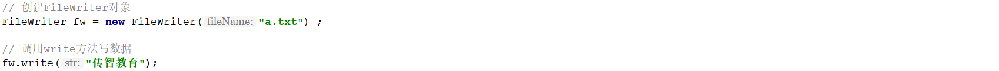
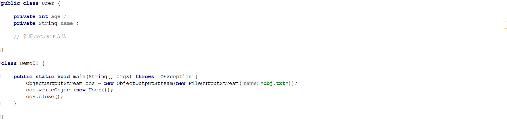
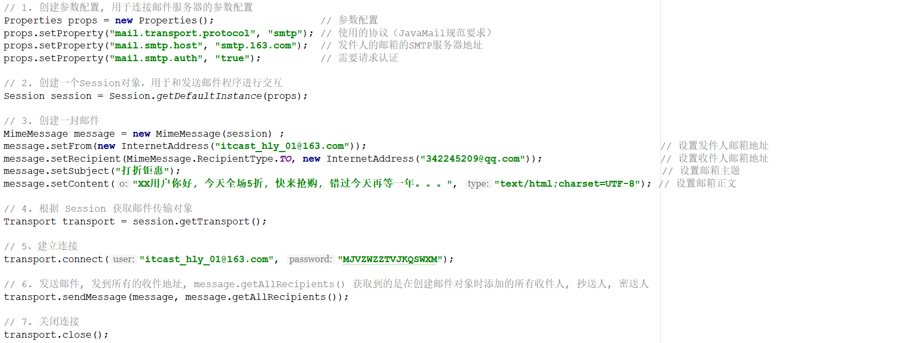
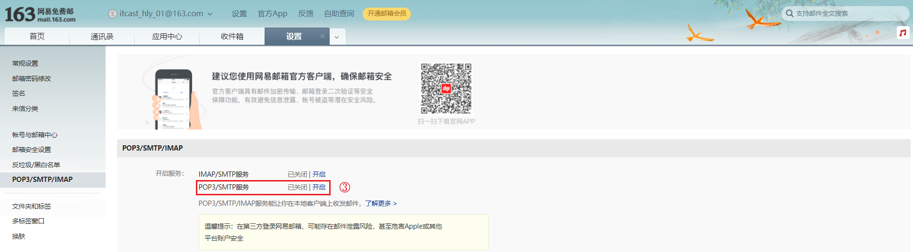
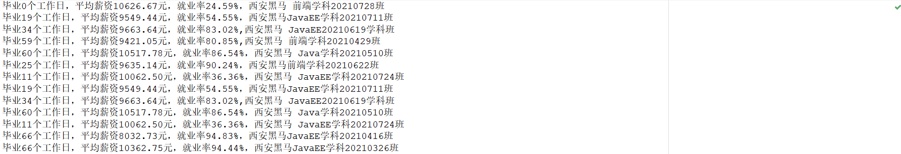
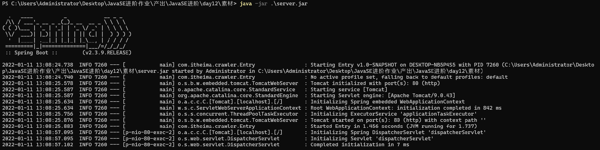
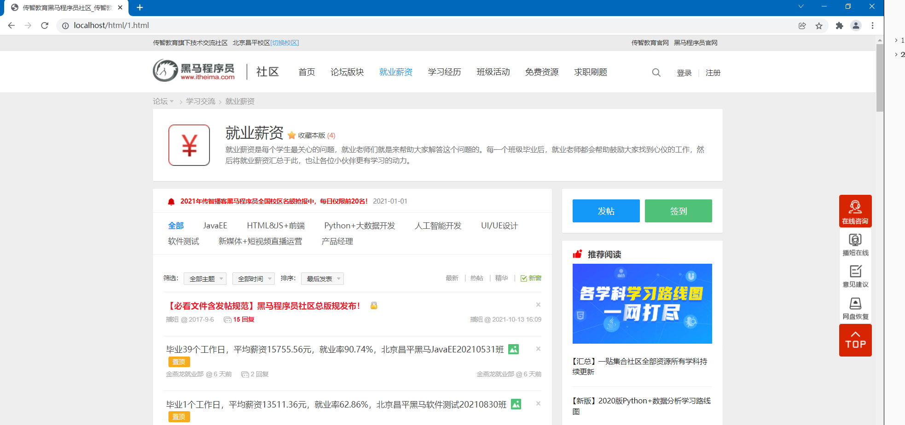

# 1 简答题

## 1.1 简答题一

如下程序执行完毕以后，a.txt文件中的内容是什么并说明原因？

|  |
| ------------------------------------------------------------ |

```java
答：
```

## 1.2 简答题二

简述flush方法和close方法的区别？

```java
答：
```

## 1.3 简答题三

请分析如下程序执行完毕以后a.txt文件的内容是什么并说明原因？如果需要在a.txt文件中保存所有数据应该怎么处理？

|  |
| ------------------------------------------------------------ |

```java
答：
```

## 1.4 简答题四

运行下述程序会出现什么错误？请说明出现该错误的原因以及如何解决该错误？

|  |
| ------------------------------------------------------------ |

```
答：
```

## 1.5 简答题五

请分析产生如下错误的原因以及对应的解决方案？

```java 
Exception in thread "main" java.io.InvalidClassException: com.itheima.io.obj.User; local class incompatible: stream classdesc serialVersionUID = 4001622083751882644, local class serialVersionUID = 6175241864707791838
	at java.io.ObjectStreamClass.initNonProxy(ObjectStreamClass.java:687)
	at java.io.ObjectInputStream.readNonProxyDesc(ObjectInputStream.java:1883)
	at java.io.ObjectInputStream.readClassDesc(ObjectInputStream.java:1749)
	at java.io.ObjectInputStream.readOrdinaryObject(ObjectInputStream.java:2040)
	at java.io.ObjectInputStream.readObject0(ObjectInputStream.java:1571)
	at java.io.ObjectInputStream.readObject(ObjectInputStream.java:431)
	at com.itheima.io.obj.Demo01.main(User.java:21)
```

```java
答：
```


# 2 编程题

## 2.1 编程题目一

**训练目标**：掌握java中高效的字符流的基本使用，以及理解其在实际开发中的应用

**需求描述**：某公司年会需要搞抽奖活动以此感谢公司员工这一年的辛勤付出。要求当某一个员工已经被抽取到了，再抽取下一个奖项的时候该员工不能再次被抽到。请编写程序实现该抽奖活动。

程序的运行效果如下所示：

|  |
| ------------------------------------------------------------ |

**实现提示**：

1、在提供的素材(lucky)项目中的指定位置补全代码实现功能

2、使用BufferedReader读取employee_names.txt文件中的数据，并将其存储到一个集合中

3、生成一个随机数，作为集合元素的索引

4、根据该索引从集合中获取一个员工姓名，并将该员工姓名从集合中移除掉

5、将集合中剩余的员工姓名通过BufferedWriter再一次写入到employee_names.txt文件中


## 2.2 编程题目二

**训练目标**：掌握java中Properties集合的使用，以及理解其在实际开发中的应用

**需求背景**：电子邮件的应用非常广泛，常见的如在某网站注册了一个账户，自动发送一封激活邮件，通过邮件找回密码，自动批量发送活动信息等。很显然这些应用不可能和我们自己平时发邮件

一样，先打开浏览器，登录邮箱，创建邮件再发送。而是通过程序实现邮件的发送。在素材文件中提供了一个项目prop，可以实现通过Java代码发送邮件。如下所示：

|  |
| ------------------------------------------------------------ |

上述代码实现了：通过网易邮箱itcast_hly_01@163.com向342245209@qq.com发送了一份邮件。效果如下所示：

|  |
| ------------------------------------------------------------ |

但是上述程序存在一定的弊端：硬编码。这样不利于后期代码的维护，比如要修改发件人、收件人、邮件主题、邮件正文等信息的时候都需要对代码进行修改。

**需求描述**：使用Properties集合对上发送邮件的代码进行优化，以提高代码的维护性。

**实现提示**：

1、上述程序中关于发件人和收件人是使用老师提供的账号。如果需要使用自己的账号来实现邮件的发送，请注册网易云邮箱，注册地址：https://mail.163.com/。注册完毕以后需要开通指定的

服务才可以实现邮件的发送。如下所示：

|  |
| ------------------------------------------------------------ |
|  |

注意：`保存好授权密码，程序中需要使用`。

2、上述发送邮件程序中可更改的参数：发件人邮箱账号信息、收件人收件账号、邮箱主题、邮箱正文

3、创建一个properties属性文件，将上述可更改的内容定义到该文件中

4、在程序中读取第三步创建的文件内容到一个Properties集合中

5、从Properties集合中获取参数信息更改原有程序

6、电脑需要联网


## 2.3 编程题目三

**训练目标**：掌握java中高效的字符流和转换流的基本使用，以及理解其在实际开发中的应用

**需求背景**：网络爬虫（又称为网页蜘蛛，网络机器人，在FOAF社区中间，更经常的称为网页追逐者），是一种按照一定的规则，自动地抓取万维网信息的程序。通过程序请求指定的网页，获取网

页数据对应的字节输入流对象，然后通过该输入流读取网页数据，再次对网页数据进行筛选获取有价值的数据，然后再将数据存储起来用于后期做数据分析。

**需求描述**：在素材的server.jar程序中存在两个网页：1.html和2.html 。现需要将这两个网页中"西安黑马"就业薪资信息，保存到一个本地文件中。程序运行完毕以后，本地文件中的数据如下所

示：

|  |
| ------------------------------------------------------------ |

**实现提示**：

1、通过`java -jar server.jar`运行server.jar程序，程序运行效果如下所示：

|  |
| ------------------------------------------------------------ |

2、server.jar程序启动起来以后，可以直接通过浏览器访问该程序中的1.html和2.html查看页面内容，如下所示访问的是1.html页面中的内容：

|  |
| ------------------------------------------------------------ |

查看2.html网页内容，在浏览器的地址栏输入该地址：http://localhost/html/2.html

3、通过程序访问server.jar程序中的网页代码已在素材crawler项目中提供好了

4、在素材crawler项目的指定位置补全代码实现功能

5、进行字符串中特定字符的替换可以考虑使用正则表达式


